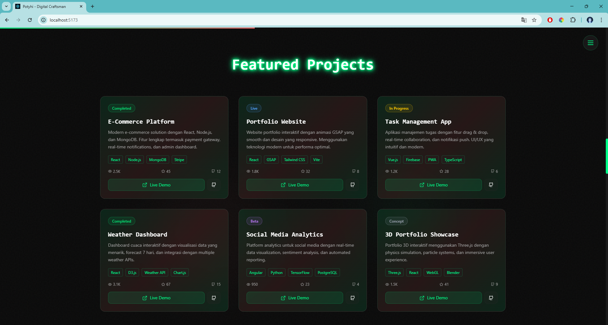
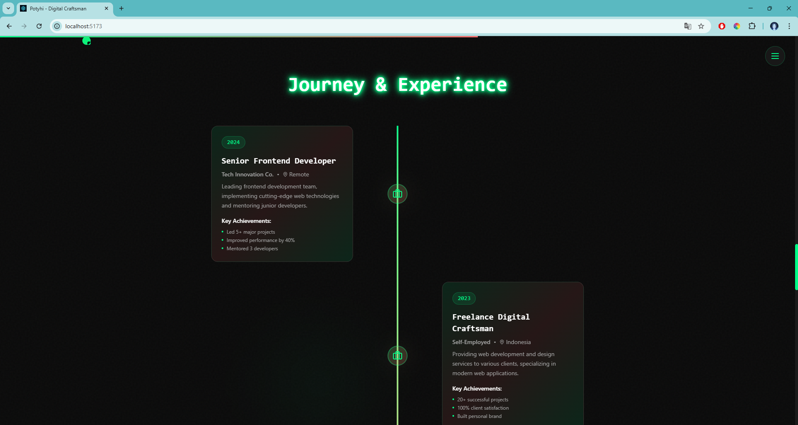
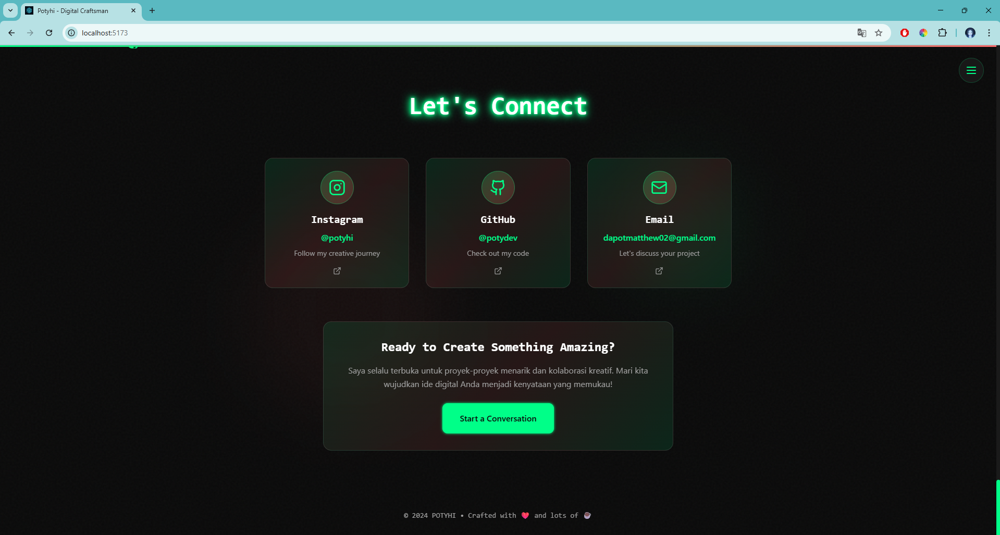

# Personal Website

A modern personal portfolio website built with React, Vite, and Tailwind CSS.

## 🖼️ Screenshots

### Homepage


### About Me Section


### Skills Section


### Featured Projects


### Journey/Experience


### Footer


## 🚀 Live Demo

Visit the live website: https://personal-website-flax-one-83.vercel.app/

## 🛠️ Technologies Used

- **React 19** - Modern React with hooks
- **Vite** - Fast build tool and dev server
- **Tailwind CSS** - Utility-first CSS framework
- **Framer Motion** - Animation library
- **GSAP** - Advanced animations
- **Three.js** - 3D graphics
- **Radix UI** - Accessible UI components
- **Lucide React** - Beautiful icons

## 📦 Features

- ✨ Modern and responsive design
- 🎨 Smooth animations and transitions
- 📱 Mobile-first approach
- ⚡ Fast loading with Vite
- 🎯 SEO optimized
- 🌙 Dark/Light theme support
- 📊 Interactive components
- 🎭 Custom cursor effects

## 🚀 Getting Started

### Prerequisites

- Node.js (v18 or higher)
- pnpm (recommended) or npm

### Installation

1. Clone the repository
```bash
git clone https://github.com/your-username/personal-website.git
cd personal-website
```

2. Install dependencies
```bash
pnpm install
```

3. Start development server
```bash
pnpm dev
```

4. Open [http://localhost:5173](http://localhost:5173) in your browser

### Build for Production

```bash
pnpm build
```

## 📁 Project Structure

```
src/
├── components/          # React components
│   ├── ui/            # Reusable UI components
│   ├── About.jsx      # About section
│   ├── Contact.jsx    # Contact form
│   ├── Hero.jsx       # Hero section
│   ├── Navigation.jsx # Navigation bar
│   ├── Projects.jsx   # Projects showcase
│   ├── Skills.jsx     # Skills section
│   └── Timeline.jsx   # Experience timeline
├── hooks/             # Custom React hooks
├── lib/               # Utility functions
└── assets/            # Static assets
```

## 🚀 Deployment

This project is configured for easy deployment on Vercel:

1. Push your code to GitHub
2. Connect your repository to Vercel
3. Vercel will automatically detect the Vite configuration
4. Deploy with one click!

## 📝 License

This project is open source and available under the [MIT License](LICENSE).

## 🤝 Contributing

Contributions are welcome! Please feel free to submit a Pull Request.

